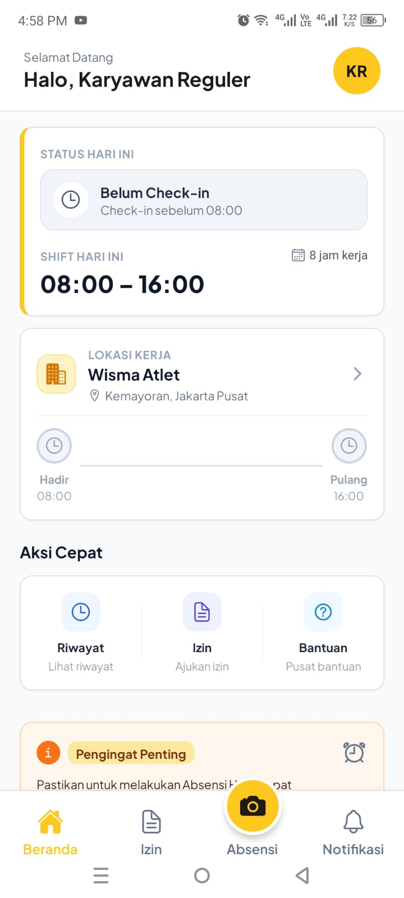
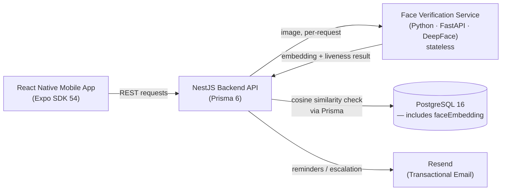
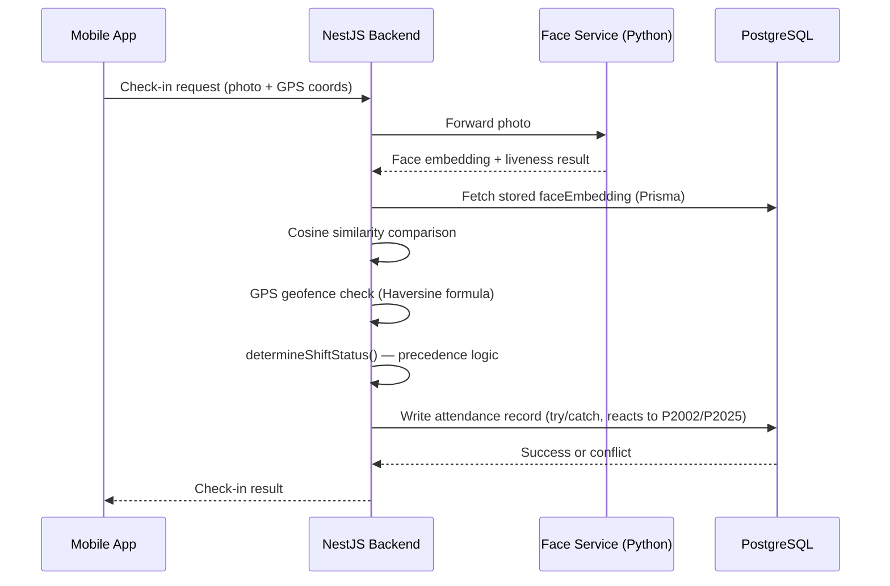

<div align="center">

# Absensi Karyawan Outsourcing

**A production-grade attendance & workforce management system for outsourced field labor (security & cleaning services) in Indonesia.**

Face-verified check-in/out · GPS geofencing · Role-based scheduling · Real-time supervisor dashboards · Automated payroll reporting


</div>

---

## Screenshot



_Employee home screen — today's schedule, attendance progress stepper, and dynamic reminders._

---

## Table of Contents

- [Absensi Karyawan Outsourcing](#absensi-karyawan-outsourcing)
  - [Screenshot](#screenshot)
  - [Table of Contents](#table-of-contents)
  - [The Problem](#the-problem)
  - [Tech Stack](#tech-stack)
    - [Architecture Overview](#architecture-overview)
  - [Key Engineering Decisions](#key-engineering-decisions)
    - [Check-in Flow (Illustrated)](#check-in-flow-illustrated)
  - [Quality Signals](#quality-signals)
  - [Current Status \& Roadmap](#current-status--roadmap)
  - [Getting Started](#getting-started)
  - [License](#license)
  - [Contact](#contact)

---

## The Problem

Outsourcing companies that place field staff (security guards, cleaners) across multiple client sites face a structural gap: **no single, real-time source of truth** for (a) what the schedule _should_ be — including changes from leave/sick days — and (b) actual attendance against that schedule, verified at the correct location.

This creates two compounding failures:

- **Internally**: payroll inaccuracy, buddy-punching risk, and supervisors who only discover a no-show 1–1.5 hours after a shift starts.
- **Externally**: client trust erosion, since outsourcing companies bill based on staff-hours that clients themselves have no visibility into.

This system replaces informal chat-based scheduling and fragmented attendance logs (paper, spreadsheets, WhatsApp) with one verified, role-scoped source of truth across three actors: **field employees**, **site supervisors**, and **HR/admin**.

> Note: this is a fictional case study built for portfolio purposes, but the problem pattern and business rules (e.g., Indonesian labor law requirements for sick-leave documentation) are modeled on real conditions in Indonesia's outsourcing labor industry.

|                       | Before                                      | After                                                          |
| --------------------- | ------------------------------------------- | -------------------------------------------------------------- |
| **Scheduling**        | Informal, chat-based (WhatsApp)             | Role-scoped source of truth, versioned with leave/sick changes |
| **Attendance record** | Paper / spreadsheets, fragmented            | Face-verified + GPS-verified, centralized                      |
| **No-show detection** | Discovered 1–1.5 hours late                 | Real-time supervisor dashboard                                 |
| **Payroll**           | Manually reconciled, inaccuracy-prone       | Automated payroll reporting                                    |
| **Client visibility** | None — billed on staff-hours they can't see | Verified attendance data available                             |

---

## Tech Stack

| Layer                   | Technology                                                                                              |
| ----------------------- | ------------------------------------------------------------------------------------------------------- |
| **Mobile**              | React Native (Expo SDK 54) · Expo Router · TanStack Query · Zustand · expo-secure-store                 |
| **Backend API**         | NestJS 11 · Prisma 6 · PostgreSQL 16                                                                    |
| **Face Verification**   | Python · FastAPI · DeepFace (MTCNN detector, FasNet anti-spoofing via PyTorch) — stateless microservice |
| **Geofencing**          | Haversine formula (application-layer, no PostGIS dependency)                                            |
| **Transactional Email** | Resend                                                                                                  |
| **Language**            | TypeScript (strict), zero `any` by convention across ~320 tests                                         |

### Architecture Overview



_Face embeddings are persisted only in PostgreSQL via the NestJS layer — the Python service stays stateless, per the reasoning in Decision #5 below._

---

## Key Engineering Decisions

Five decisions that mattered more than "which library to use" — the reasoning behind them, and what problem each one actually solved.

<details>
<summary><strong>1. Reactive Prisma exception handling over preemptive checks</strong></summary>

**Problem:** Concurrent requests — two simultaneous check-in attempts, two supervisors approving the same leave request — can cause duplicate writes or lost updates if handled naively.

**Decision:** Mutation paths (`attendance.service.ts`, `supervisor-sites.service.ts`, `employees.service.ts`) skip the `findUnique()`-then-`update()` pattern entirely. They write directly inside a `try/catch` and react to Prisma's `P2002` (unique violation) and `P2025` (not found) error codes.

**Why it matters:** A preemptive check-then-write always leaves a race window — two requests can both pass the check before either commits. Letting the database constraint be the single source of truth for conflict detection closes that window completely, with no extra round-trip on the common path.

</details>

<details>
<summary><strong>2. One timezone utility, not five reinventions of it</strong></summary>

**Problem:** Early on, three separate modules each reimplemented "start of day in Asia/Jakarta" independently — one used `lte: 23:59:59` (silently excluding records with non-zero milliseconds), another added `24h - 1ms`, a third used an exclusive upper bound. All three gave _slightly_ different answers for the same input.

**Decision:** Consolidated into a single `common/utils/date.util.ts` (`getJakartaStartOfDay`, `getJakartaSingleDayRange`, `getJakartaDateRange`, `combineJakartaDateTime`, `getJakartaTodayStr`, `formatJakartaDate`, `formatJakartaTime`), and refactored every consumer — schedules, employees, leave requests, dashboard, attendance — to use it exclusively.

**Why it matters:** This wasn't cosmetic. The `23:59:59` pattern was a real correctness bug that could silently drop legitimate records from date-range queries. One tested utility eliminates the entire bug class instead of patching each occurrence as it's found.

</details>

<details>
<summary><strong>3. A single function decides attendance status — used by two features that must never disagree</strong></summary>

**Problem:** The precedence logic for a shift's status (`TIDAK_HADIR` > `TERLAMBAT`/`HADIR` > `IZIN` > `BELUM`) had to be identical in two independent places: the supervisor's real-time dashboard, and HR's aggregate attendance summary used for payroll.

**Decision:** Extracted the logic into one pure function, `determineShiftStatus()` (`common/utils/shift-status.util.ts`), and made both features call it instead of maintaining parallel implementations.

**Why it matters:** Business rules like this evolve — a future grace-period requirement, for instance. A single implementation guarantees the dashboard and the payroll report can never silently drift out of sync with each other.

</details>

<details>
<summary><strong>4. Deliberate scoping: silent-narrow on read, explicit reject on write</strong></summary>

**Problem:** When a supervisor's request touches data outside their assigned sites, the API needs one consistent, intentional response — not an ad-hoc decision per endpoint.

**Decision:** Read endpoints (e.g., `schedules.service.ts#findAll`) silently narrow out-of-scope queries to an empty array. Write endpoints (`create`, `update`, `remove` in the same service) throw an explicit `ForbiddenException` when the target is out of the caller's scope.

**Why it matters:** A closed-world empty result on read avoids leaking whether out-of-scope data even exists. Writes — which have irreversible consequences — fail loudly instead. The same reasoning extends into a documented 404-vs-403 convention used project-wide: 404 when the caller has no legitimate reason to know a resource exists, 403 when they do.

</details>

<details>
<summary><strong>5. Face embeddings live in PostgreSQL — the verification service stays stateless</strong></summary>

**Problem:** A separate Python/FastAPI/DeepFace service handles face embedding extraction and liveness detection. Where should the resulting embedding actually live?

**Decision:** The embedding (`User.faceEmbedding: Float[]`) is persisted in the primary PostgreSQL database via Prisma. The face-verification service is kept entirely stateless — it computes and returns an embedding + liveness result per request, and stores nothing.

**Why it matters:** A stateful microservice would create a second, independently-drifting source of truth for employee data — the same anti-pattern the schema already avoids elsewhere (`JadwalShift` as the _only_ source of daily placement, with no separate "assignment" table). Cosine similarity comparison happens in the NestJS layer, against the one stored copy.

</details>

### Check-in Flow (Illustrated)

A concrete walkthrough of how Decisions #1, #3, and #5 above come together during an actual check-in:



---

## Quality Signals

| Signal             | Result                                                                                                                          |
| ------------------ | ------------------------------------------------------------------------------------------------------------------------------- |
| Automated tests    | **321 tests** (Jest) across 23 suites, passing end-to-end                                                                       |
| Lint & build       | `npm run lint` and `npm run build` kept clean throughout development — not retrofitted at the end                               |
| Type safety        | Strict discipline against `any` across every module, including test files                                                       |
| Concurrency safety | Race-condition-safe status transitions via conditional `updateMany` (e.g., leave approval/rejection) instead of read-then-write |
| Access control     | Every API endpoint scoped and role-guarded (`JwtAuthGuard` + `RolesGuard`), validated end-to-end for 401/403/400 paths          |

---

## Current Status & Roadmap

| Component   | Status                   |
| ----------- | ------------------------ |
| Backend API | ✅ Feature-complete      |
| Mobile App  | 🚧 In active development |

**Backend — feature-complete.** All endpoints in the API contract are implemented and tested:

- Site & organizational structure, supervisor-site assignment
- Auth (login, forced password change, self-service reset)
- Face registration & face-verified check-in/check-out with GPS geofencing
- Leave requests (with overlap validation, medical-document requirement for multi-day sick leave, orphaned-request fallback routing to HR)
- Automated reminders & escalation (cron-based T+5 employee reminder, T+15 supervisor alert, auto-mark-absent)
- Supervisor dashboards (real-time attendance, unfilled shifts)
- HR reporting (attendance summary, verification-attempt audit trail, PDF/XLSX export)

**Mobile app — in active development** (built in parallel with the backend, and continuing alongside my job search):

- ✅ Auth flow: login, forced password change, forgot/reset password
- ✅ Employee home dashboard: today's schedule, attendance progress stepper, dynamic reminders
- ✅ Face registration flow (camera → preview → confirm)
- 🚧 Employee check-in/out screen, leave request submission, notifications list
- 🚧 Supervisor and HR Admin dashboards

**Known technical debt** (tracked, not hidden):

- Orphaned leave-request notifications don't yet self-heal if a covering schedule is deleted _after_ submission
- Cron job has no distributed mutex lock — acceptable at current single-instance scale, would need addressing before horizontal scaling

---

## Getting Started

This is a multi-service project (mobile + backend + Python microservice + PostgreSQL).

<details>
<summary><strong>Click to expand full local setup instructions</strong></summary>

```bash
# 1. Install dependencies (npm workspaces)
npm install

# 2. Start PostgreSQL
docker-compose up -d

# 3. Configure environment
cp apps/backend/.env.example apps/backend/.env
cp apps/face-service/.env.example apps/face-service/.env
# fill in DATABASE_URL, JWT_SECRET, RESEND_API_KEY, FACE_SERVICE_URL, etc.

# 4. Set up the database
cd apps/backend
npm run prisma:generate
npm run prisma:seed

# 5. Run the backend
npm run start:dev

# 6. Run the face-verification service (separate terminal)
cd apps/face-service
uvicorn main:app --reload

# 7. Run the mobile app (separate terminal)
cd apps/mobile
npm run start
```

</details>

---

## License

MIT © 2026 Ahmad Dhani Setiawan — see [LICENSE](LICENSE).

---

## Contact

**Ahmad Dhani Setiawan**
[LinkedIn](https://www.linkedin.com/in/ahmaddhanisetiawan/) · [Email](mailto:dnistwn31@gmail.com) · [GitHub](https://github.com/danisetiawan31/absensi-karyawan-outsourcing)

_Built solo, end-to-end, as a portfolio project — architecture decisions, trade-offs, and technical debt are documented deliberately, not glossed over._
